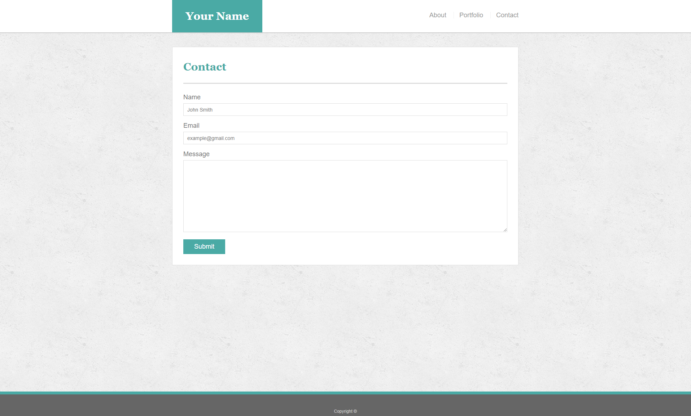
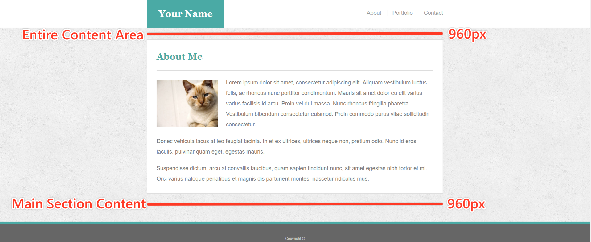

# BEFORE GETTING STARTED:

* Go to github.com

* Click the + button in top right

* Select new repository

* Fill out the information (name is Basic-Portfolio) and make sure to select initialize repository with a README.

* In Github go to the main page for your new repository

* Click the green button to clone repository.

    * Copy the link

* Go to a terminal and navigate to the folder you want your repository folder to be in.

* run the command ```git clone copiedlink``` where copiedlink is what you copied earlier.

* then change directories into the newly created folder e.g. Basic-Portfolio  ```cd Basic-Portfolio```

* IMPORTANT: before doing making any files or changes we want to create and switch to a branch called gh-pages. ```git checkout -b gh-pages```

* after this we can work on our homework, or add files and when we are ready to commit we do the following two commands, we repeat this every time we want to save, the message should be descriptive of what you did:
```
git add .
git commit -m "I added files and changed css"
```

## Recommended Assignment - That Portfolio Though

## Overview

In this assignment, you'll build a professional portfolio site using HTML/CSS. These instructions include a short style guide; follow it to design an aesthetically pleasing layout while creating different kinds of complex HTML elements.

### Before You Begin

* Welcome to your first opportunity as a front-end web designer. You will be advocating for your most important client—yourself! By making a portfolio, you'll take your first step toward building your web development brand.

* This will be one of your harder assignments, if only because you're just getting your feet wet in web design. Trust us, though; it will get easier. Invest your time in this assignment, and it will pay dividends!

### Submission on BCS

* Please submit the link to the Github Repository!

### Instructions

1. Create a new repository in GitHub called `Basic-Portfolio` and clone to your machine using the steps at the top of the document.

2. Navigate to the `Basic-Portfolio` folder that you just cloned onto your machine. Inside this folder, create the following:

   * 3 HTML documents: `index.html`, `contact.html` and `portfolio.html`.
   * A folder called `assets`.
   * Inside the assets directory, make two additional folders: `css` and `images`.
     * In the `css` folder, make a file called `style.css`.
     * In the `images` folder, save the images you plan on using (like your profile image and the placeholder images for the portfolio).

3. Reference these screenshots for your site:

   

   

   

   * **IMPORTANT** You can either choose to match these designs exactly, or have fun and be creative, whatever motivates you to do your best!

4. When you create a website, it's standard practice to code your HTML files before writing any CSS and to write up one HTML file before moving onto the next. Write your HTML semantically, too:

   * If something is a heading, you use a heading tag.
   * If something is a list, you use an unordered or ordered list tag.
   * So on and so forth.

5. The content for the `index.html` should be unique to **you**.

   * Write a paragraph or two about yourself. Make it fun, show your personality!
   * The main logo where it says "Your Name" should say your name. This may make the logo section smaller or wider depending on how long your name is—that is fine and expected.
   * Add and commit your code often, especially when you complete a page.
   * You can push to gh-pages whenever you want to check out your site deployed.

6. After all of your HTML is written, you can begin styling your pages using the `style.css` file you created.

   * Be sure to [validate your html](https://validator.w3.org/#validate_by_input).
   * Consult the specs below these instructions for advice on styling your CSS files.

7. When you are done, follow the steps at the bottom of these instructions to turn in your homework.

### Additional Specifcations

1. Colors _Pro-tip: Use the [Eye Dropper](https://chrome.google.com/webstore/detail/eye-dropper/hmdcmlfkchdmnmnmheododdhjedfccka) Chrome extension to find the colors used on web pages._
   * Teal color (used for headings and backgrounds): `#4aaaa5`
   * Regular font color (used for paragraphs and all text besides the headings): `#777777`
   * Main header background color: `#ffffff`
   * Main header border color: `#cccccc`
   * Footer background color: `#666666`
   * Main content background color: `#ffffff`
   * Main content border color: `#dddddd`

2. Fonts:
   * For heading fonts use `font-family: 'Georgia', Times, Times New Roman, serif;`.
   * For all other fonts use `'Arial', 'Helvetica Neue', Helvetica, sans-serif;`.

3. Profile Image Found on `index.html`:
   * Use a picture of yourself.
   * If you don't have a picture, you can grab a placeholder image from [LoremPixel](http://lorempixel.com/). Save the images to your `images` folder.

4. Portfolio Images:
   * Placeholder images can be found at [LoremPixel](http://lorempixel.com/).
   * Save the images to your `images` folder.

5. Background Images:
   * The background pattern used was found on [Subtle Patterns](https://subtlepatterns.com/). You can browse through that site and find whichever pattern you like.

6. Dimensions:
   * The entire content and the main section content area is `960px` wide.

   

### Bonus

1. Make your pages more sophisticated by adding style to text links, to image links, and to buttons for when a user hovers their cursor over them. A CSS hover tutorial can be found [here](http://www.codeitpretty.com/2013/06/how-to-use-css-hover-effects.html).

2. You can use [Adobe Kuler](https://color.adobe.com/create/color-wheel/) to find colors that match the theme (in this case, the primary color is Teal `#4aaaa5`).

3. Make a "sticky footer." You will notice the dark grey footer will always rest just below the content. This is fine whenever your site has enough content to push it down past the height of most monitors. But if there isn't much content in the body, the footer could rest in the middle of the page:
   * Try to code the footer in a way that it will always remain at the bottom of the page, no matter how short the content is. A sticky footer tutorial can be found [here](https://css-tricks.com/couple-takes-sticky-footer/).
   * Give the Footer the following CSS:
   * border-top: 8px solid #4aaaa5;

### Helpful Hints

* For help with Git and GitHub, be sure to consult the GitHub Supplemental Guide sent to you in class.

* Don't forget to look into these concepts: `float`, `padding`, `margin`, `display`, `overflow`, `clear` and `text-align`.

* This will be a tough assignment, but towards the end of the course, you'll look back to this exercise and realize just how much you've grown as a developer. Stay positive! You've got this!

### Reminder: Submission on BCS

* Please submit the links as detailed in the instructions at the end of this document.

- - -

### Minimum Requirements

Attempt to complete homework assignment as described in instructions. If unable to complete certain portions, please pseudocode these portions to describe what remains to be completed.

- - -

### One More Thing

If you have any questions about this project or the material we have covered, please post them in the community channels in slack so that your fellow developers can help you! If you're still having trouble, you can come to office hours for assistance from your instructor and TAs.

**Good Luck!**

## WHEN FINISHED: Request a Code Review and Submit Homework

* when we are ready to publish our website and share it with others:
```
git push origin gh-pages
```

* Go to your homework repository on github

* Locate the "New pull request" button on the screen, it is below the bar that says "# commits" "# branches" "# releases" "#contributor" on the left hand side.  Click on it.

* ensure the left hand side button says "base: master" and click on the right hand side button and change it to "compare: gh-pages"

* fill out a title and a comment describing what you've done for your homework.

* Click "Create pull request"

* Copy link for pull request and paste into bootcamp spot. (e.g. https://github.com/jtblanche/Basic-Portfolio/pull/1)

* Go to your repository's settings and find the github pages link and check that that is working, then paste it into bootcamp spot as well. (e.g. https://jtblanche.github.io/Basic-Portfolio)