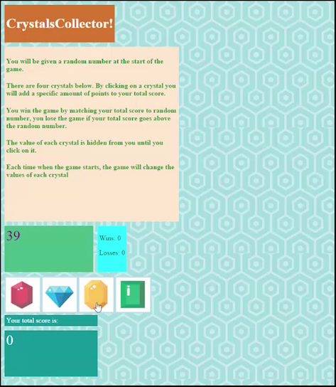

# BEFORE GETTING STARTED:

* Go to github.com

* Click the + button in top right

* Select new repository

* Fill out the information (name is unit-4-game) and make sure to select initialize repository with a README.

* In Github go to the main page for your new repository

* Click the green button to clone repository.

    * Copy the link

* Go to a terminal and navigate to the folder you want your repository folder to be in.

* run the command ```git clone copiedlink``` where copiedlink is what you copied earlier.

* then change directories into the newly created folder e.g. unit-4-game  ```cd unit-4-game```

* IMPORTANT: before doing making any files or changes we want to create and switch to a branch called gh-pages. ```git checkout -b gh-pages```

* after this we can work on our homework, or add files and when we are ready to commit we do the following two commands, we repeat this every time we want to save, the message should be descriptive of what you did:
```
git add .
git commit -m "I added files and changed css"
```

## jQuery Assignment

### Overview

In this assignment, you'll create another fun and interactive game for web browsers. This time, your app must dynamically update your HTML pages with the jQuery library.

### Submission on BCS

* Please submit the links described at the bottom of these instructions.

### Before You Begin

1. Create a new GitHub repo called `unit-4-game`, then clone it to your computer using the steps at the top of this document.

2. Inside the `unit-4-game` folder, create an `index.html` file.

3. Still inside the `unit-4-game` directory, make a folder called `assets`.
   * Inside the `assets` directory, make three additional folders: `javascript`, `css` and `images`.
     * In the `javascript` folder, make a file called `game.js`.
     * In the `css` folder, make a file called `style.css`.
     * In the `css` folder, make a file called `reset.css`. Paste into it the code found from the Meyerweb Reset.
     * In the images folder, save any of the images you plan on using.

4. Push the above changes to GitHub. 

5. Choose whichever game you want to make from the choices below. The CrystalsCollector game is the recommended option, but if you are looking for an extra hard challenge then take a stab at the Star Wars exercise. (Note: Only choose the Star Wars Exercise if you are feeling very comfortable with the material covered in class. The Crystal Collector activity is plenty challenging enough!).

### Option One: CrystalsCollector Game (Recommended)



1. [Watch the demo](https://youtu.be/yNI0l2FMeCk).

2. The player will have to guess the answer, just like in Word Guess. This time, though, the player will guess with numbers instead of letters. 

3. Here's how the app works:

   * There will be four crystals displayed as buttons on the page.

   * The player will be shown a random number at the start of the game.

   * When the player clicks on a crystal, it will add a specific amount of points to the player's total score. 

     * Your game will hide this amount until the player clicks a crystal.
     * When they do click one, update the player's score counter.

   * The player wins if their total score matches the random number from the beginning of the game.

   * The player loses if their score goes above the random number.

   * The game restarts whenever the player wins or loses.

     * When the game begins again, the player should see a new random number. Also, all the crystals will have four new hidden values. Of course, the user's score (and score counter) will reset to zero.

   * The app should show the number of games the player wins and loses. To that end, do not refresh the page as a means to restart the game.

##### Option 1 Game design notes

* The random number shown at the start of the game should be between 19 - 120.

* Each crystal should have a random hidden value between 1 - 12.

### Option Two: Star Wars RPG Game (Challenge)


1. [Watch the demo](https://youtu.be/klN2-ITjRt8).

2. Here's how the app works:

   * When the game starts, the player will choose a character by clicking on the fighter's picture. The player will fight as that character for the rest of the game.

   * The player must then defeat all of the remaining fighters. Enemies should be moved to a different area of the screen.

   * The player chooses an opponent by clicking on an enemy's picture.

   * Once the player selects an opponent, that enemy is moved to a `defender area`.

   * The player will now be able to click the `attack` button.
     * Whenever the player clicks `attack`, their character damages the defender. The opponent will lose `HP` (health points). These points are displayed at the bottom of the defender's picture. 
     * The opponent character will instantly counter the attack. When that happens, the player's character will lose some of their `HP`. These points are shown at the bottom of the player character's picture.

3. The player will keep hitting the attack button in an effort to defeat their opponent.

   * When the defender's `HP` is reduced to zero or below, remove the enemy from the `defender area`. The player character can now choose a new opponent.

4. The player wins the game by defeating all enemy characters. The player loses the game the game if their character's `HP` falls to zero or below.

##### Option 2 Game design notes

* Each character in the game has 3 attributes: `Health Points`, `Attack Power` and `Counter Attack Power`.

* Each time the player attacks, their character's Attack Power increases by its base Attack Power. 
  * For example, if the base Attack Power is 6, each attack will increase the Attack Power by 6 (12, 18, 24, 30 and so on).
* The enemy character only has `Counter Attack Power`. 

  * Unlike the player's `Attack Points`, `Counter Attack Power` never changes.

* The `Health Points`, `Attack Power` and `Counter Attack Power` of each character must differ.

* No characters in the game can heal or recover Health Points. 

  * A winning player must pick their characters wisely by first fighting an enemy with low `Counter Attack Power`. This will allow them to grind `Attack Power` and to take on enemies before they lose all of their `Health Points`. Healing options would mess with this dynamic.

* Your players should be able to win and lose the game no matter what character they choose. The challenge should come from picking the right enemies, not choosing the strongest player.

### Reminder: Submission on BCS

* Please submit both the deployed Github.io link to your homework AND the link to the Github Repository!

- - -

### Minimum Requirements

Attempt to complete homework assignment as described in instructions. If unable to complete certain portions, please pseudocode these portions to describe what remains to be completed. Adding a README.md as well as adding this homework to your portfolio are required as well and more information can be found below.

- - -

### Create a README.md

Add a `README.md` to your repository describing the project. Here are some resources for creating your `README.md`. Here are some resources to help you along the way:

* [About READMEs](https://help.github.com/articles/about-readmes/)

* [Mastering Markdown](https://guides.github.com/features/mastering-markdown/)

- - -

### Add To Your Portfolio

After completing the homework please add the piece to your portfolio. Make sure to add a link to your updated portfolio in the comments section of your homework so the TAs can easily ensure you completed this step when they are grading the assignment. To receive an 'A' on any assignment, you must link to it from your portfolio.

- - -

### One More Thing

If you have any questions about this project or the material we have covered, please post them in the community channels in slack so that your fellow developers can help you! If you're still having trouble, you can come to office hours for assistance from your instructor and TAs.

**Good Luck!**

## WHEN FINISHED: Request a Code Review and Submit Homework

* when we are ready to publish our website and share it with others:
```
git push origin gh-pages
```

* Go to your homework repository on github

* Locate the "New pull request" button on the screen, it is below the bar that says "# commits" "# branches" "# releases" "#contributor" on the left hand side.  Click on it.

* ensure the left hand side button says "base: master" and click on the right hand side button and change it to "compare: gh-pages"

* fill out a title and a comment describing what you've done for your homework.

* Click "Create pull request"

* Copy link for pull request and paste into bootcamp spot. (e.g. https://github.com/jtblanche/unit-4-game/pull/1)

* Go to your repository's settings and find the github pages link and check that that is working, then paste it into bootcamp spot as well. (e.g. https://jtblanche.github.io/unit-4-game)